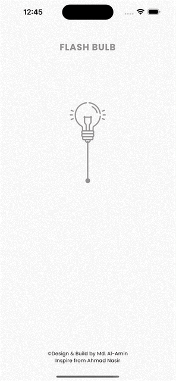
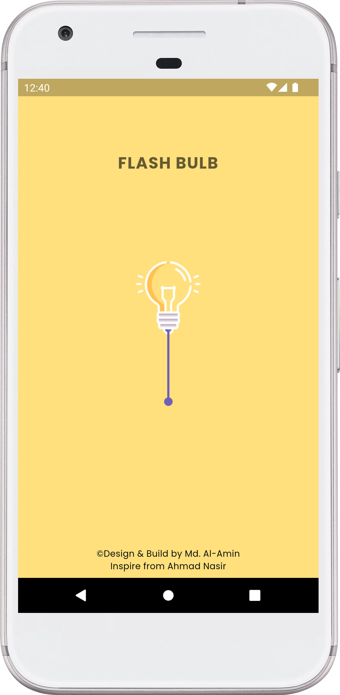
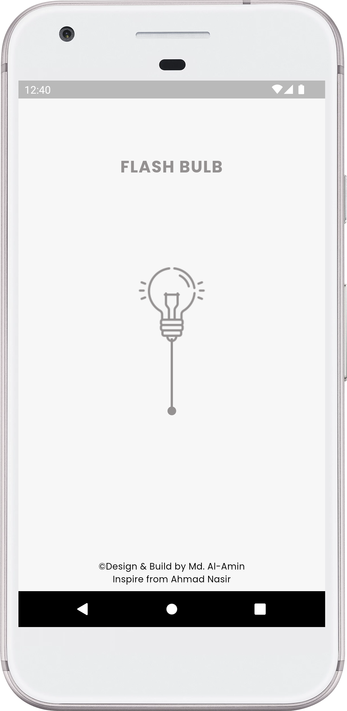

# FlashBulb - A Flutter Application

Illuminate your world with a Flutter app that turns your device torch light ON/OFF using an awesome string/rope interface.

## Description

Introducing 'Flash Bulb'—your go-to app for illuminating moments with stunning animations. Features include seamless ON/OFF control of device flash, enhanced by captivating animations for a truly immersive experience. Illuminate your world in style with Flash Bulb! 🔦✨

**Support Me**

- Source Code of project on Gumroad [here](https://alaminkarno.gumroad.com/l/flash-bulb)
- Support me via buy me a coffee. [here](https://www.buymeacoffee.com/alaminkarno)

**Packages we are using:**

- google_fonts
- torch_light
- audioplayers

**App Credit**

- Inspire from [Ahmad Nasir](https://github.com/M4DGENIUS0)

**Code Credit**

- Code using Flutter with ❤️ by [Md. Al-Amin](https://github.com/alamin-karno)

## Animation (GIF):
|                Flash Bulb App (GIF)                |                          Flash Bulb (ON)                           |                          Flash Bulb (OFF)                          |
|:--------------------------------------------------:|:------------------------------------------------------------------:|:------------------------------------------------------------------:|
|  |  |  |

### Repository Owner Info

### Md. Al-Amin
##### Junior Software Engineer (Android & iOS) at Rokomari.com

__Email :__ [alamin.karno@outlook.com](mailto:alamin.karno@outlook.com) \
__Github :__ [Md. Al-Amin](https://github.com/alamin-karno) \
__Facebook :__ [মোঃ আল-আমিন খন্দকার কর্ণ](https://facebook.com/alamin.kanro) \
__Linkedin :__ [Md. Al-Amin](https://www.linkedin.com/in/alaminkarno/)